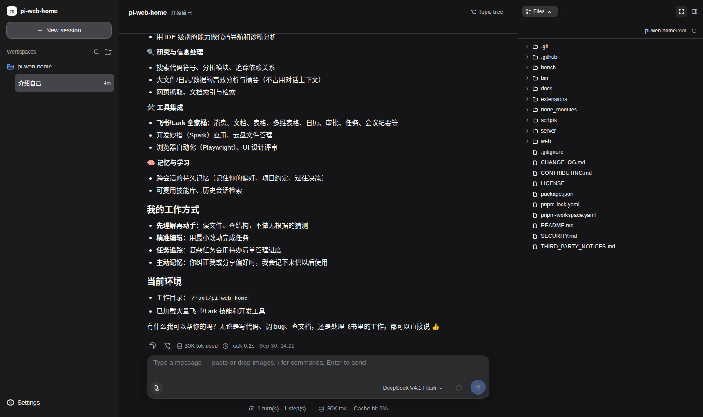
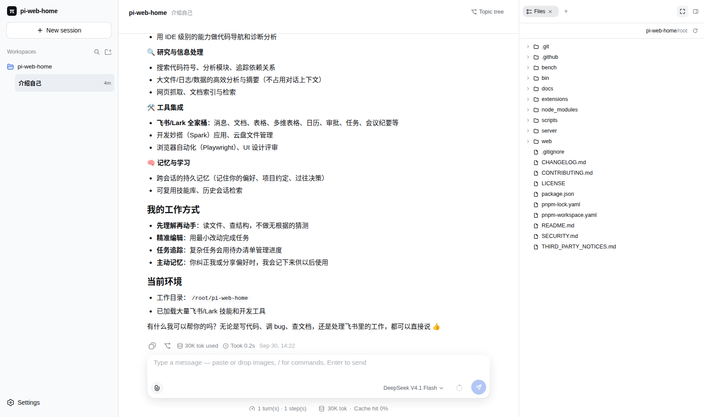

# pi-web-home

**English** · [简体中文](./docs/README.zh-CN.md)

A web UI for the [pi](https://github.com/earendil-works/pi-coding-agent) coding agent. Open a browser, add a project directory, and chat with pi — from your desktop or any other device on your home LAN. No terminal required.

```sh
npx pi-web-home    # serves the UI on http://<your-ip>:8319
```

| Dark theme | Light theme |
| :---: | :---: |
|  |  |

## Features

#### Projects & sessions

- **One directory = one project.** Add any local directory through the built-in file picker; each project holds its own sessions.
- **Multi-session** with rename, delete, and per-session model selection.
- **Session fork & topic tree** — branch any message into a new line of work without losing the original.
- **Slash commands & skills** — pi's commands, prompt templates, and skills complete as you type.

#### Chat

- **Live streaming** responses with Markdown and syntax highlighting.
- **Image input** — paste or attach pictures into the prompt.
- **Steer & follow-up** — redirect a running turn or queue a follow-up without waiting.
- **Real-time performance metrics** in the status bar: turns, steps, LLM / tool time, TTFT, and output speed (tok/s), DeepSeek-Harness style. Click for the full breakdown.
- **Abort** any running turn instantly.

#### Workspace sidebar

- **File tree** with preview for files in the project directory.
- **Git panel** — stage, commit, push, restore, and switch branches without leaving the UI. Working-tree changes refresh automatically.
- **Todo tracking** and **embedded browser** for quick checks.

#### Settings

- **Providers & models** — manage API keys and model entries; fetch the model list from a provider directly.
- **MCP servers** — add, edit, enable/disable, and restart MCP servers.
- **Plugins** — view and manage installed pi extensions.
- **Appearance** — dark / light / system theme, font size, transcript and send behaviour. Bilingual UI (English / 简体中文).

**Performance metrics** (from [pi-turn-metrics](https://github.com/leon-zym/pi-turn-metrics))

- `turns · steps` — interaction rounds and agent steps per session.
- `LLM time · Tool time` — model inference vs. tool execution, shown separately so a slow turn is easy to attribute.
- `TTFT · tok/s` — average time to first token and decode throughput.

## Requirements

- Node.js `>= 22.19.0`
- A working [pi](https://github.com/earendil-works/pi-coding-agent) installation with at least one configured provider
- pnpm (for building from source only)

## Deployment

### Option 1 — run once (no install)

```sh
npx pi-web-home
```

### Option 2 — global install

```sh
npm install -g pi-web-home
pi-web-home
```

### Option 3 — systemd service (recommended for always-on LAN use)

Build and install from source, then register a service:

```sh
git clone https://github.com/wooxi/pi-web-home
cd pi-web-home
pnpm install && pnpm build && npm link
```

`/etc/systemd/system/pi-web-home.service`:

```ini
[Unit]
Description=pi-web-home — pi coding agent web UI (home LAN)
After=network-online.target
Wants=network-online.target

[Service]
Type=simple
Environment=PI_WEB_HOME_OPEN=0
ExecStart=/usr/bin/pi-web-home
Restart=always
RestartSec=3

[Install]
WantedBy=multi-user.target
```

```sh
sudo systemctl daemon-reload
sudo systemctl enable --now pi-web-home
```

The service starts on boot, restarts after crashes, and survives terminal closure.

### Option 4 — as a pi package

```sh
pi install npm:pi-web-home
```

Then, inside a pi session:

```text
/web            # start the UI (opens the browser)
/web --no-open  # start without opening a browser
/web status     # is it running?
/web stop       # stop it
```

## Configuration

All environment variables are optional:

| Variable | Default | Description |
| :-- | :-- | :-- |
| `PI_WEB_HOME_PORT` | `8319` | HTTP port |
| `PI_WEB_HOME_HOST` | `0.0.0.0` | Bind address. Set `127.0.0.1` for loopback only |
| `PI_WEB_HOME_OPEN` | `1` (CLI) | Set `0` to not open a browser |
| `PI_WEB_HOME_IDLE_MS` | `600000` | Idle timeout for a session process |
| `PI_WEB_HOME_MAX_SESSIONS` | `8` | Concurrent session process limit |
| `PI_WEB_HOME_SSE_BUFFER` | `4194304` | Per-connection SSE buffer cap (bytes) |
| `PI_WEB_HOME_STATIC_DIR` | auto | Override the built front-end directory; empty = API only |
| `PI_WEB_HOME_HOME` | `~/.pi-web-home` | Data directory root |
| `PI_WEB_HOME_SESSION_DIR` | pi's default | Force pi sessions under this root |


## Approval mode (built-in pi-auto-approval)

Every session ships with a [pi-auto-approval](https://github.com/Europa2061/pi-auto-approval) gate (vendored under `extensions/pi-auto-approval/`, Apache-2.0). A switch next to the model picker (labels in Chinese) toggles it:

- **智能审批** (Smart, default): AI clears low-risk actions, asks you in a dialog when unsure
- **全自动** (Full auto): AI-only review — unsure or failed actions are blocked
- **关闭** (Off): no gating, tool calls run directly

Switching applies to running sessions immediately. The same menu picks the classifier model (defaults to the session's model — one extra LLM call per gated step); every decision lands in an audit log.
## Getting started

1. Open `http://<server-ip>:8319` in a browser.
2. Click **+** in the left column, pick the project directory in the file picker, and confirm.
3. Click **+** under the project to start a session and send your first prompt.

## Security notice

The server has **no authentication**. It is designed for a **trusted home LAN only**:

- Do not expose it to the public internet or forward it through a reverse proxy from outside your router.
- If other people share your LAN and you do not trust them, set `PI_WEB_HOME_HOST=127.0.0.1` to restrict it to the server machine itself.
- Requests from public domains (non-private Host/Origin) are rejected; loopback and private LAN addresses are accepted.

See [SECURITY.md](./SECURITY.md) and [Network & privacy](./docs/network-and-privacy.md) for details.

## Known limitations

See [Known limitations](./docs/known-limitations.md) (Chinese) for the current list.

## Development

```sh
pnpm install
pnpm dev         # front-end + back-end with live reload
pnpm build       # production build
pnpm typecheck   # typecheck both sides
pnpm test        # all tests (vitest)
```

## License

MIT, see [LICENSE](./LICENSE).

The UI and parts of the server logic are ported and adapted from [deepseek-harness](https://github.com/deepseek-ai/deepseek-harness) (MIT, Copyright (c) 2026 DeepSeek), [pi-web-simple](https://github.com/woxihejinghao/pi-web) (MIT), and [@earendil-works/pi-coding-agent](https://github.com/earendil-works/pi-coding-agent) (MIT). [THIRD_PARTY_NOTICES.md](./THIRD_PARTY_NOTICES.md) lists the copied ranges and their sources — that file ships with the source, please keep it.

This is an unofficial project, not affiliated with pi (Earendil Works) or DeepSeek; the π name and marks belong to their respective owners.
